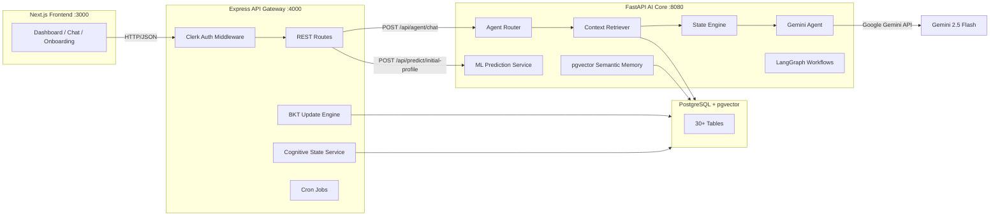
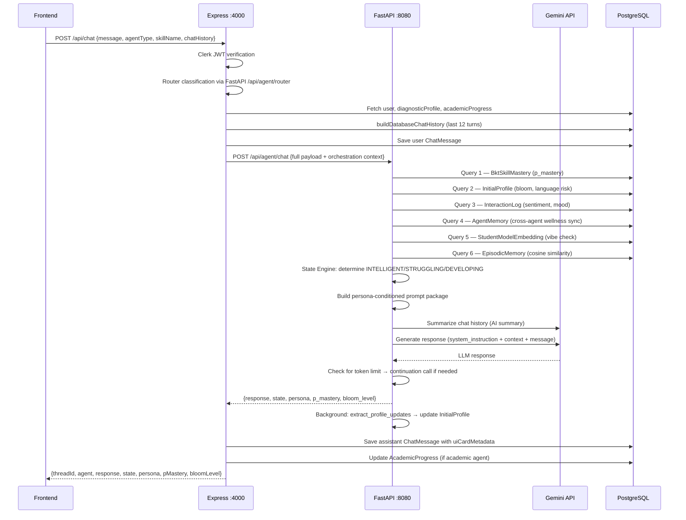

# LUMINA — Complete Deep Analysis

> **Generated**: June 2026  
> **Project**: LUMINA — Culturally-Aware Multi-Agent AI Tutoring Ecosystem for Pakistani University Students  
> **Scope**: Full-stack analysis of all three backends (FastAPI, Express, Next.js Frontend)

---

## Table of Contents

1. [Executive Summary](#1-executive-summary)
2. [High-Level Architecture](#2-high-level-architecture)
3. [Backend — FastAPI (AI Core)](#3-backend--fastapi-ai-core)
4. [Backend — Express (API Gateway)](#4-backend--express-api-gateway)
5. [Frontend — Next.js](#5-frontend--nextjs)
6. [Database Architecture](#6-database-architecture)
7. [Intelligence Layers Deep-Dive](#7-intelligence-layers-deep-dive)
8. [Data Flow Diagrams](#8-data-flow-diagrams)
9. [File-by-File Reference](#9-file-by-file-reference)
10. [Technical Debt & Observations](#10-technical-debt--observations)

---

## 1. Executive Summary

LUMINA is a **three-tier, multi-agent AI tutoring system** that personalizes learning for Pakistani university students. It combines:

| Intelligence Layer | Technology | Purpose |
|---|---|---|
| **BKT Mastery Tracking** | Pre-trained CSV params + Bayesian update | Per-skill probability P(Know) |
| **Cognitive Trend Detection** | Linear regression on sliding windows | Struggle / Flow / Disengagement classification |
| **LLM Response Generation** | Google Gemini (state/persona-conditioned) | Adaptive, culturally-aware responses |

The system consists of **four independently running services**:

| Service | Stack | Port | Role |
|---|---|---|---|
| **FastAPI** (`backend/`) | Python, SQLAlchemy, pgvector | 8080 | AI inference, Gemini orchestration, ML prediction, semantic memory |
| **Express** (`backend-express/`) | Node.js, Sequelize, PostgreSQL | 4000 | API gateway, auth (Clerk), DB CRUD, BKT updates, onboarding pipeline |
| **Next.js** (`FYP_Project/`) | React, TypeScript, TailwindCSS | 3000 | Frontend SPA — dashboard, chat UI, onboarding wizard |
| **PostgreSQL** | v14+, pgvector extension | 5432 | Shared relational + vector database |

---

## 2. High-Level Architecture



### Request Flow (Chat)



---

## 3. Backend — FastAPI (AI Core)

> **Directory**: `backend/`  
> **Entry point**: `main.py`  
> **Port**: 8080

This is the **AI brain** of LUMINA. It handles all machine learning inference, LLM orchestration, state-driven prompt engineering, and semantic memory.

### 3.1 Module Map

```
backend/
├── main.py                          # FastAPI app, lifespan, BKT CSV loader, REST routes
├── db.py                            # SQLAlchemy ORM models (18 tables), pgvector support
├── ai_service.py                    # Initial profiling ML prediction (Random Forest)
├── test_db.py                       # Database connection test
├── bkt_parameters_trained.csv       # Pre-trained BKT parameters (~500+ skills)
├── student_model.pkl                # Serialized Random Forest model (scikit-learn)
├── encoders.pkl                     # Serialized label encoders
├── routers/
│   └── agent_router.py              # All FastAPI REST endpoints (856 lines)
├── services/
│   ├── gemini_agent.py              # Gemini API integration, embeddings, memory
│   ├── state_engine.py              # State determination + prompt template rendering
│   ├── context_retriever.py         # 6-query DB context assembly (StudentContext)
│   ├── trend_engine.py              # Heuristic cognitive state classifier
│   ├── agent_registry.py            # Agent profile definitions + guardrails
│   └── agents.py                    # Agent class wrappers (Academic, Wellness, Social)
├── app/graph/
│   ├── workflow.py                  # LangGraph real-time chat workflow (6 nodes)
│   ├── semester_graph.py            # LangGraph semester analysis workflow (4 nodes)
│   ├── state.py                     # GraphState TypedDict
│   ├── memory.py                    # Long-term memory fetch helper
│   └── nodes/
│       ├── gateway.py               # Context retrieval node
│       ├── coordinator.py           # LLM-based routing node
│       ├── academic.py              # Academic agent node
│       ├── wellness.py              # Wellness agent node (crisis detection)
│       ├── social.py                # Social agent node
│       └── critic.py                # Quality-check / pass-through node
├── requirements.txt
└── pyproject.toml
```

### 3.2 File Deep-Dive

#### `main.py`
**Purpose**: Initializes the FastAPI app, loads BKT parameters from CSV on startup, and exposes prediction/analysis REST endpoints.
- `_load_bkt_csv()`: Reads long-format BKT parameters and caches them in memory.
- `/api/predict/initial-profile`: ML inference endpoint for onboarding.

#### `db.py`
**Purpose**: Defines 18 SQLAlchemy ORM models. Uses pgvector for embeddings.
- Manages dual-ownership: Some tables are FastAPI-owned (`agent_memory`, `episodic_memory`), others are read-only mirrors of Express-owned tables (`initial_profiles`, `interaction_logs`).

#### `ai_service.py`
**Purpose**: Runs the Random Forest model (`student_model.pkl`) to predict student success probability and derive support flags from onboarding data.

#### `routers/agent_router.py`
**Purpose**: The central orchestration router containing all agent endpoints.
- `/api/agent/chat`: The main pipeline handling context retrieval, state engine, and LLM orchestration.
- `/api/agent/stream`: Experimental SSE streaming via LangGraph.

#### `services/gemini_agent.py`
**Purpose**: Core LLM adapter handling all interactions with Google Gemini API.
- Handles token truncation, embedding generation, context window construction, and profile update extraction in the background.

#### `services/state_engine.py`
**Purpose**: Evaluates `StudentContext` and builds persona-conditioned system prompts (STRUGGLING → Socratic Tutor, INTELLIGENT → Peer-to-Peer, DEVELOPING → Encouraging Coach).

#### `services/context_retriever.py`
**Purpose**: Executes 6 DB queries to assemble a complete `StudentContext` snapshot (BKT mastery, InitialProfile, InteractionLog, AgentMemory, StudentModelEmbedding, EpisodicMemory).

#### `services/trend_engine.py`
**Purpose**: Analyzes sliding windows of frustration, accuracy, and boredom to classify cognitive state (CRITICAL_STRUGGLING, FLOW_STATE, etc.) using linear regression.

#### `app/graph/*`
**Purpose**: Experimental multi-agent graph workflows using LangGraph for real-time chat and semester analysis.

---

## 4. Backend — Express (API Gateway)

> **Directory**: `backend-express/`  
> **Entry point**: `server.js`  
> **Port**: 4000

Express serves as the **API gateway**, handling authentication, database CRUD, BKT updates, and proxying AI requests to FastAPI.

### 4.1 Module Map

```
backend-express/
├── server.js                              # Express app initialization, route mounting
├── config/
│   └── database.js                        # Sequelize PostgreSQL connection
├── middlewares/
│   └── clerkMiddleware.js                 # Clerk JWT verification middleware
├── controllers/
│   ├── chatController.js                  # Chat proxy to FastAPI, history, memories
│   ├── onboardingControllers.js           # 8-step onboarding pipeline
│   ├── bktController.js                   # BKT observation recording
│   ├── dashboardController.js             # Dashboard data aggregation
│   ├── authControllers.js                 # Auth helpers
│   ├── clerkWebhookController.js          # Clerk webhook handler (user sync)
│   ├── counselorController.js             # Human counselor case management
│   └── observationsController.js          # Student interaction logging
├── model/
│   ├── index.js                           # Model registry + associations
│   ├── Users.js                           # User model (Clerk-synced)
│   ├── InitialProfile.js                  # Raw onboarding data + ML predictions
│   ├── DiagnosticProfile.js               # Structured diagnostic profile
│   ├── AcademicProgress.js                # Per-course academic tracking
│   ├── BktSkillMastery.js                 # BKT per-skill mastery table
│   ├── StudentProfileState.js             # Hidden cognitive state snapshots
│   ├── StudentInteraction.js              # Observable interaction events
│   ├── InteractionLog.js                  # Interaction event log
│   ├── ChatThread.js                      # Chat conversation threads
│   ├── ChatMessage.js                     # Individual chat messages
│   ├── CounselorCase.js                   # Human counselor cases
│   ├── SocialMetrics.js                   # Social support metrics
│   └── WellnessLog.js                     # Wellness tracking log
├── services/
│   ├── cognitiveStateService.js           # BKT updates + cognitive state computation
│   ├── profileMapper.js                   # Form data → structured profile mapping
│   ├── cronJobs.js                        # Scheduled tasks (2-week analysis)
│   ├── chatThreadService.js               # Thread management
│   └── sessionService.js                  # Session helpers
├── routes/
│   └── [Various REST routes]
└── package.json
```

### 4.2 Key Controllers & Services

#### `controllers/chatController.js`
**Purpose**: Proxies chat messages to FastAPI `/api/agent/chat`. Handles fallback resilience if FastAPI is down. Also provides endpoints for fetching chat history and generating topic-bucketed memory summaries.

#### `controllers/onboardingControllers.js`
**Purpose**: An 8-step pipeline mapping raw form data to structured profiles, seeding DB tables, calling FastAPI ML predictions, and persisting the final initialized profile.

#### `services/cognitiveStateService.js`
**Purpose**: Hidden state inference engine mapping observable behaviors to latent learner states. Updates Bayesian Knowledge Tracing (BKT) probabilities per interaction. Computes linear regression trends.

#### `middlewares/clerkMiddleware.js`
**Purpose**: Integrates Clerk authentication. Automatically provisions users in the PostgreSQL DB upon first valid request.

---

## 5. Frontend — Next.js

> **Directory**: `FYP_Project/`  
> **Entry point**: `app/layout.tsx`  
> **Port**: 3000

The frontend is a **Next.js App Router** application with Clerk authentication, TailwindCSS styling, and a component library built on Radix UI (shadcn/ui).

### 5.1 Architecture Patterns

- **API Communication**: All frontend network calls MUST use `lib/api.ts` which talks exclusively to the Express backend.
- **State Management**: Uses Zustand for global dashboard state (`lib/store.ts`) and onboarding state (`lib/onboardingStore.ts`).
- **Telemetry**: `ContinuousObserver` component tracks page engagement and logs observations to the backend.
- **Design System**: Dual themes ("Kraken" light / "BMW M" dark). Extensive use of framer-motion and Recharts for data visualization.

---

## 6. Database Architecture

LUMINA uses a unique **dual-ORM** pattern where both backends share the same PostgreSQL database:

| Aspect | Sequelize (Express) | SQLAlchemy (FastAPI) |
|---|---|---|
| Schema Authority | **Primary** — creates/migrates tables via `sync({ alter: true })` | Read-only mirrors with `extend_existing: True` |
| Tables Owned | users, initial_profiles, diagnostic_profiles, academic_progress, bkt_skill_mastery, student_profile_state, interaction_logs, chat_messages, counselor_cases | agent_memory, episodic_memory, knowledge_chunks, plan tables, progress snapshots |
| Vector Support | None | pgvector (1536d embeddings) |

---

## 7. Intelligence Layers Deep-Dive

### 7.1 Layer 1 — BKT Mastery Tracking
Updates mastery probabilities per skill based on user correctness, learning rates, guess, and slip parameters.

### 7.2 Layer 2 — Cognitive Trend Detection
Uses linear regression on sliding windows of interaction data to detect if a student is struggling, flowing, or disengaged. Implemented in both Python and JavaScript.

### 7.3 Layer 3 — LLM Orchestration
A 5-task pipeline assembling 6-table context, applying state-driven prompt templates (Persona matching), generating responses via Gemini, and asynchronously extracting profile updates.

---

## 8. Technical Debt & Observations

### Strengths
- Clean separation of concerns (Express handles CRUD/Auth, FastAPI handles AI/ML).
- Dual-ORM strategy prevents schema conflicts while allowing shared data.
- 6-query context retrieval provides deep personalization without overwhelming the LLM.
- Fallback strategies ensure the app remains functional even if AI services are down.

### Issues to Address
| Severity | Issue | Location |
|---|---|---|
| 🔴 High | **Dual LLM Paths:** LangGraph nodes and `semester_graph.py` reference `_get_openai_client()`, which no longer exists (migrated to Gemini). Will crash if invoked. | `backend/app/graph/*` |
| 🔴 High | **DB Sync:** `sequelize.sync({ alter: true })` runs on startup in `server.js` and can cause data loss in production. | `backend-express/server.js` |
| 🟡 Medium | **Duplicate Fields:** `diagnosticAssessment` is defined twice in Pydantic models. | `backend/main.py:163-165` |
| 🟡 Medium | **Dummy Embeddings:** ML inference endpoint inserts `[0.0]*1536` instead of real embeddings. | `backend/main.py:209` |
| 🟢 Low | **Unused Models:** `services/agents.py` is defined but unused by the active pipeline. | `backend/services/agents.py` |
| 🟢 Low | **Token Bug:** `_truncate_to_token_limit` calculation is flawed and equates word length to 1. | `backend/services/gemini_agent.py:126` |
